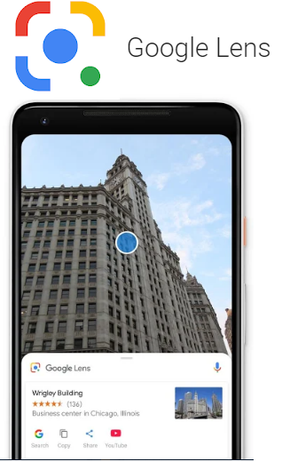
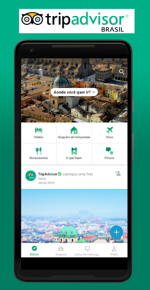

# Projeto API
## YeahCult
Descubra o mundo ao seu redor!

# Concorrentes
Apps concorrentes do YeahCult

* Google Maps
-Descubra lugares e se aventure pela área como um morador local
-Saiba mais sobre restaurantes, eventos e atividades locais do seu interesse
-Confira os novos lugares e o que está em alta nas áreas que você mais gosta
-Economize tempo com a redefinição de trajeto automática baseada no trânsito em tempo real, incidentes e vias interditadas

**Diferencial:** Inclui trazer a historia do local em Audio .

* Google Lens
-Identifique plantas e animais
-Descubra o nome daquela planta na casa do seu amigo ou a raça do cachorro que você viu no parque.

**Diferencial:**  Inclui trazer informações de locais fora do comum, que outros usuarios contribuirão.

* TripAdvisor
-Descubra locais perto de onde você está
-Faça avaliações e inclua fotos

**Diferencial:** Inclui traduzir informações dos locais pra outra lingua .

* Foursquare
-O Foursquare ajuda você a pesquisar e descobrir ótimos lugares, em qualquer parte do mundo.
-Busque por restaurantes, cafés, vida noturna, lojas e muito mais. Veja o que está por perto ou planeje algo com antecedência.

**Diferencial:** Inclui transformar texto em audio .

##Dados do formulario
-Olá venho te convidar para dar sua opinião sobre nosso aplicativo, o YeahCult é uma plataforma para ter acesso a informação em texto e áudio sobre locais peculiares, já pensou você passar por algum local onde um app possa te alertar   sobre a historia, curiosidades e você como usuário poder compartilhar o que sabe também. Colabore conosco preenchendo esse formulário e dando sua opinião sincera !

