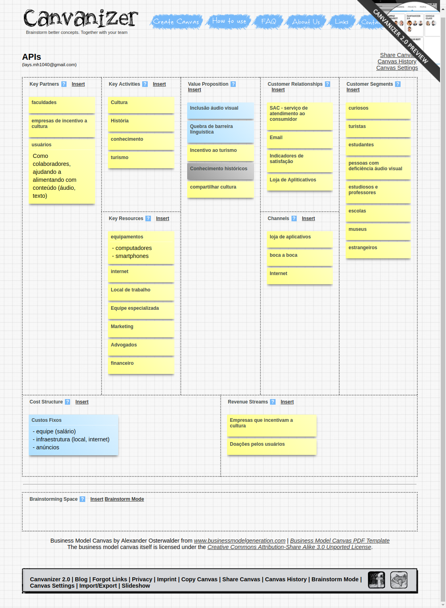
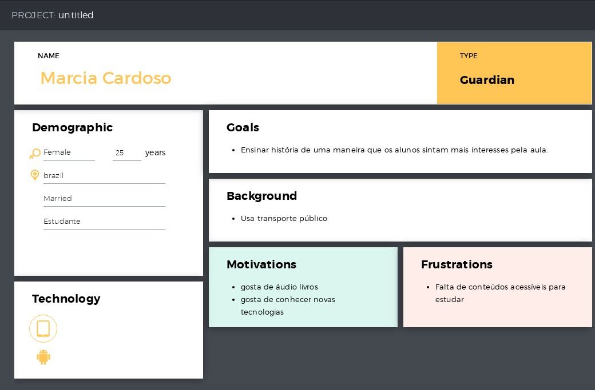
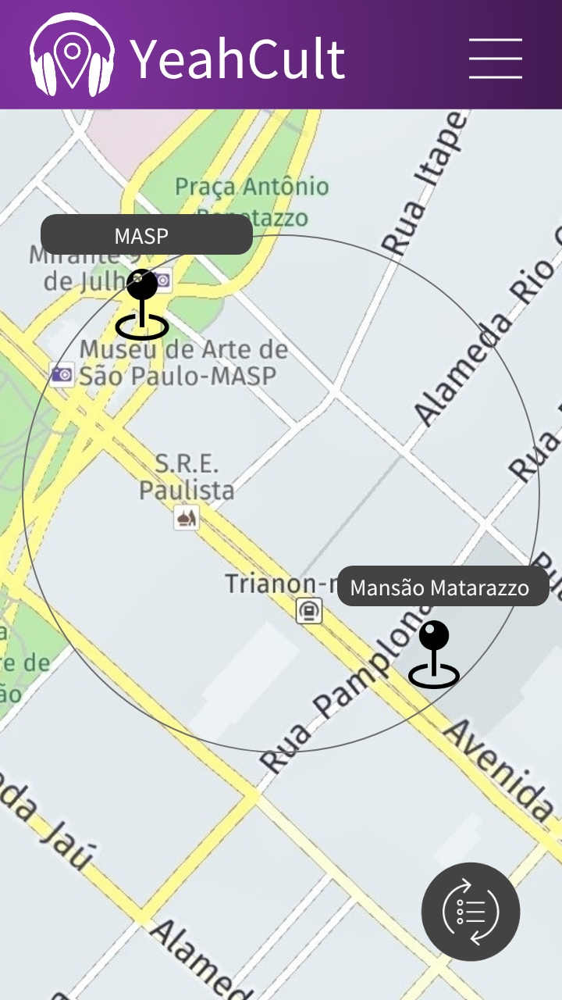

# Projeto API
## YeahCult
Descubra o mundo ao seu redor!

## Introdução
História, cultura e arte estão em todos os lugares!

Você gostaria de tornar sua rotina mais divertida? Descobrir coisas interessantes sobre o bairro onde você mora, a história de prédios por onde você passa a caminho do trabalho? Quem sabe descobrir cultura até mesmo enquanto espera na sala do dentista?

Te convidamos a sair do turismo convencional e embarcar conosco nesta jornada de conhecer o 'mundo' ao nosso redor!

## Canvas
[Link Canvas](https://canvanizer.com/canvas/wfIUYRhiePBAE)

## Personas

## Diagrama de blocos

## Protótipo
Protótipo de média fidelidade:
[Link protótipo Marvel](https://marvelapp.com/515i7e9/screen/56950990)

## API's utilizadas
* [Google maps](https://developers.google.com/maps/documentation/?hl=pt-br)
* [Wikipedia](https://pt.wikipedia.org/wiki/Wikip%C3%A9dia:Central_de_pesquisas/Portal_de_dados/API)
* [Voice RSS](http://www.voicerss.org/)
* Tradutor

## Road map
>Versão 1.0.0
* Histórias via Wikipédia
* Áudio com voz sintética
* Tradução para o inglês
* Pontos de interesse

>Versão 2.0.0
* Acessibilidade para deficientes visuais
* Usuários podem contribuir com fotos, áudios e comentários
* Áudio com voz humana
* Geolocalização
* Notificação sobre pontos próximos a sua localização atual
* Tradução para outros idiomas
* Salvar Favoritos

>Versão 3.0.0
* Pesquisa de pontos através de texto, áudio ou imagem
* Rotas (rotas programadas de pontos estabelecidos, ex rota do negro, casas de grandes escritores, Grafiti, etc)
