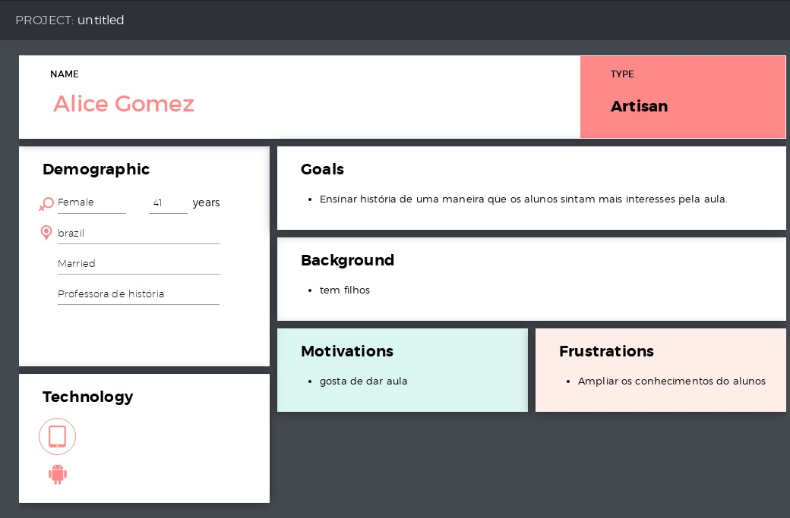
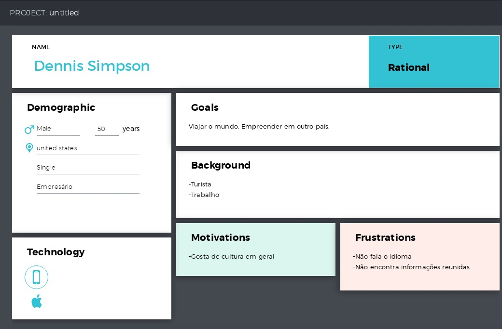
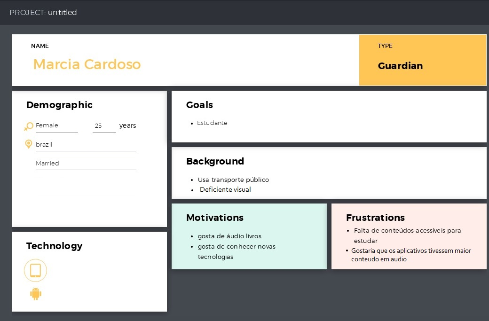
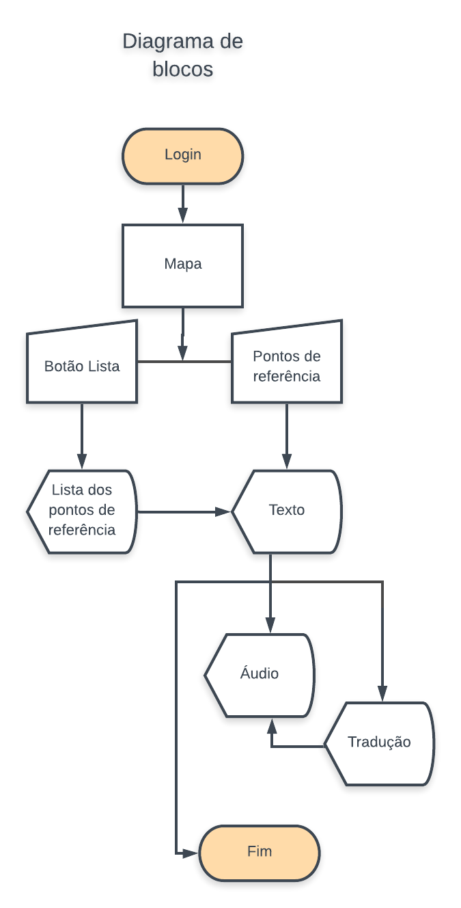

# Projeto API
## YeahCult
Descubra o mundo ao seu redor!

## Introdução
Passmos tanto tempo nas tarefas rotineiras, em filas ou na condução, por exemplo, e quase não temos tempo para consumir cultura.

Então pensamos, tem MUITA coisa interessante espalhada por aí ao nosso redor, nós é que não nos damos conta, porque estamos com os olhos viciados pela rotina.

Nossa ideia é despertar um novo olhar para as coisas que nos cercam, contar sua história, seu valor.

Seria muito interessante se a gente pudesse ouvir um áudio contanto a história da rua enquanto caminhamos por ela indo para o trabalho, por exemplo. E se você ainda descobrisse histórias e curiosidades sobre o bairro onde você mora?

Nessa primeira versão, trazemos conteúdo da Wikipedia, com possibilidade de áudio em voz sintética e tradução do texto para o inglês.

Nas versões futuras, nosso desejo é promover  mais a inclusão, com audios ainda melhores com narração humana, textos inseridos pela comunidade, tornar o aplicativo 'vivo'. 
Inclusão de rotas, para fzr um passeio guiado, etc.

E falar sobre a monetização, através do apoio de empresas públicas e privadas, planos de incentivo a cultura, e crowfunding, por quê não?

## Canvas
[Link Canvas](https://canvanizer.com/canvas/wfIUYRhiePBAE)

## Personas

## Diagrama de blocos

## Protótipo
Protótipo de média fidelidade:
[Link protótipo Marvel](https://marvelapp.com/515i7e9/screen/56950990)

## API's utilizadas
* [Google maps](https://developers.google.com/maps/documentation/?hl=pt-br)
* [Wikipedia](https://pt.wikipedia.org/wiki/Wikip%C3%A9dia:Central_de_pesquisas/Portal_de_dados/API)
* [Voice RSS](http://www.voicerss.org/)
* Tradutor

## Road map
### Versão 1.0.0
* Resumo via Wikipédia
* Áudio com voz sintética
* Tradução para o inglês
* Pontos de interesse

### Versão 2.0.0
* Acessibilidade para deficientes visuais
* Usuários podem contribuir com fotos, áudios e comentários
* Áudio com voz humana
* Geolocalização
* Notificação sobre pontos próximos a sua localização atual
* Tradução para outros idiomas
* Salvar Favoritos

### Versão 3.0.0
* Pesquisa de pontos através de texto, áudio ou imagem
* Rotas (rotas programadas de pontos estabelecidos, ex rota do negro, casas de grandes escritores, Grafiti, etc)
